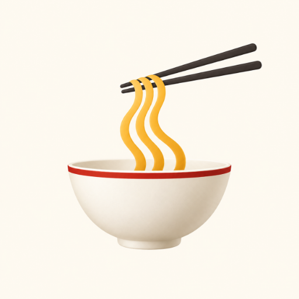
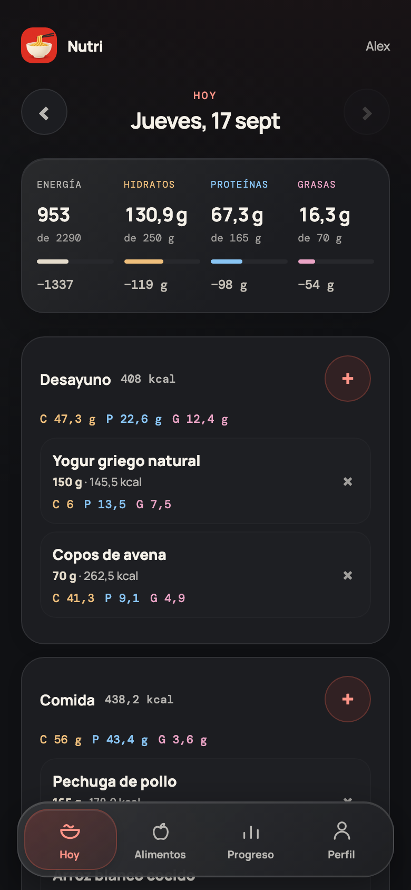
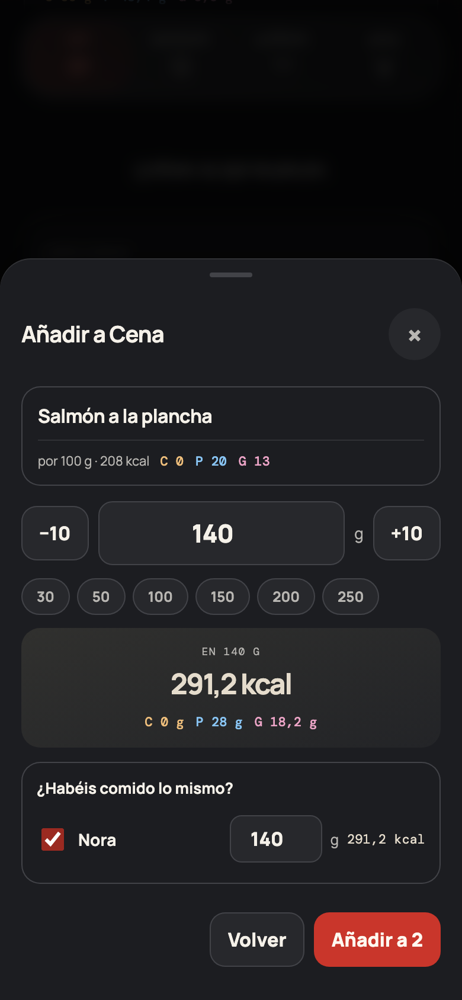
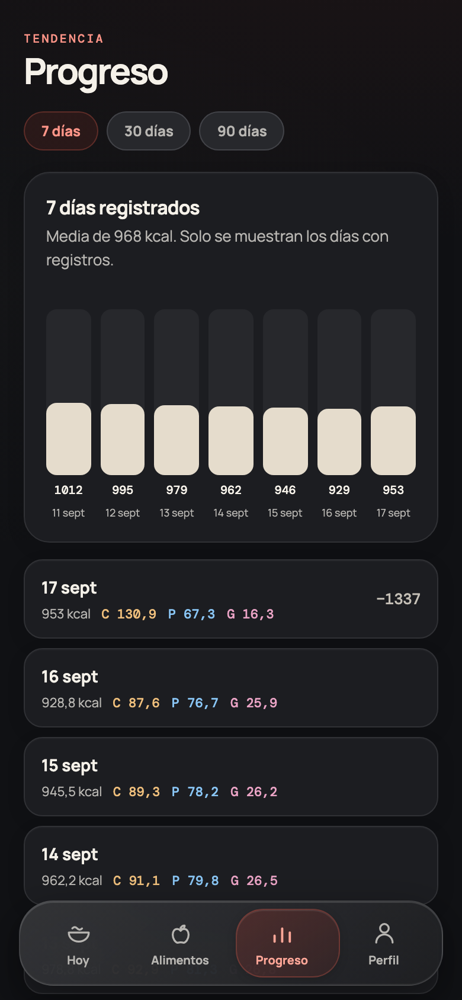

<div align="center">



# Nutri

**A nutrition diary for two people who just want to know what they ate.**

Log the meal, see what is left. No coaching, no streaks, no subscription.

</div>

<table>
<tr>
<td width="33%"></td>
<td width="33%"></td>
<td width="33%"></td>
</tr>
<tr>
<td align="center"><sub>One day at a time</sub></td>
<td align="center"><sub>Cooked once, logged twice</sub></td>
<td align="center"><sub>Only the days you logged</sub></td>
</tr>
</table>

## What it does

Carbohydrates, protein and fat in grams. Energy is always `4 × carbs + 4 × protein + 9 × fat`, so your goal is whatever your macros add up to and nothing recalculates it behind your back.

The home screen is a single day split into five named meals — Desayuno, Comida, Merienda, Cena, Snacks — because nobody remembers what time they ate. The totals sit on top: what you have eaten against your goal, and underneath the difference. **`−N` in green** while there is room left, **`+N` in red** once you are past it. What is unknown reads `—`, never zero.

Each macro keeps one colour everywhere: hidratos amber, proteínas blue, grasas pink. You read a number without hunting for its label.

### Adding food

Search looks in your own catalogue first and in [Open Food Facts](https://world.openfoodfacts.org) second, in one list, in that order. Scan the barcode or type it.

A barcode is not a unique key in real life — shops reuse them — so a scan lists **every** product that matches instead of guessing, yours first. If a code is nowhere to be found, the form opens with it already filled in and asks for the minimum: a name and kcal, carbs, protein and fat per 100 g. Leave blank whatever the label does not say; it is stored as unknown, not as zero.

Pick a public result and it is copied into your catalogue, so next time it is already yours.

An optional `Rellenar con IA` action can search the web and propose a food name, brand and nutrients. It runs on the server with OpenAI's Responses API, GPT-5.6 Luna and the web search tool; the API key never reaches the browser. The proposal is editable and sources are shown before you save it. Nutrition values remain a suggestion to check against the label, especially for branded products.

### Two people, one kitchen

Each profile keeps its own goals, diary and history, and both share one food catalogue. You choose who you are once after signing in and the device remembers.

When you cook the same thing for both, tick the other person in the add sheet and their own gram field appears: same dish, different helping, one tap.

### The small things that matter daily

- The add sheet opens on the foods this profile uses most often for that meal, with the latest portion remembered; the plus button logs one directly and keeps the sheet open for another quick add. The search field stays quiet until you tap it.
- Tap a logged portion to change the amount, move it to another meal or another day, or delete it.
- Copying yesterday asks first, shows what it will add and skips anything already there, so pressing it twice cannot duplicate the day.
- Entries keep a snapshot of the food, so fixing a catalogue mistake never rewrites what you already ate.
- The open day keeps itself up to date. When the other phone adds to your diary — which the shared dish feature does on purpose — it shows up on its own, without reopening anything.
- Log without signal and it syncs when you are back.

## Run it

Node 22.23+ and a MongoDB instance.

```sh
npm ci
cp .env.example .env      # set MONGODB_URI, and APP_PASSWORD or DEV_AUTH_BYPASS=1
npm run server            # API on :3100
npm run dev               # UI, proxies /api
```

Want to poke at it without installing MongoDB? `npm run build && node scripts/preview-local.mjs` starts a throwaway diary on an in-memory database, discarded when you stop it.

| Script | What it does |
|---|---|
| `npm test` | Arithmetic and API tests, against a real temporary MongoDB |
| `npm run check` | Drives the UI in a browser: bad input, failed saves, offline, four widths |
| `npm run screenshots` | Regenerates the images above from a seeded diary |
| `npm run icons` | Rebuilds the app icons from `public/noodle-master.png` |

## Self-hosting

`compose.yaml` is the whole stack: the app, an authenticated MongoDB, a daily backup job and an optional Cloudflare Tunnel connector. It is the same file that runs in production — there is no second, truer copy elsewhere.

```sh
cp .env.example .env      # fill in the passwords and APP_ORIGIN
docker compose up -d --build
```

**No service publishes a host port.** The app and MongoDB share an internal network that has no route out; a second network exists only so the tunnel connector can reach the app and so the app can reach Open Food Facts. The app runs read-only with `no-new-privileges` and memory, CPU and process limits, and MongoDB is reachable only with the application credentials, scoped to the two databases and nothing else.

Because nothing is published, the tunnel is the way in, and the connector is part of the stack: `up -d` brings it up with everything else and compose refuses to start without a `TUNNEL_TOKEN`. Running cloudflared on the host instead? Drop that service and point the hostname at the app container. Creating the tunnel and its DNS record is a manual step this repository does not perform.

State lives where `MONGO_DATA_PATH` and `BACKUP_PATH` say, `./data/...` by default. Containers carry the `autoheal` label, so a [willfarrell/autoheal](https://github.com/willfarrell/docker-autoheal) sidecar will restart them when a health check fails.

A tunnel gives you transport, not identity. Put [Cloudflare Access](https://developers.cloudflare.com/cloudflare-one/) in front and set `AUTH_MODE=cloudflare`; add `CF_ACCESS_TEAM_DOMAIN` and `CF_ACCESS_AUD` and the origin verifies the assertion Access attaches to every allowed request, so a policy that gets removed becomes a 403 instead of an open diary. The audience tag is the `kid` parameter of the Access login redirect for your hostname. Keep the API uncached at the edge; never add a Cache Everything rule to it.

To enable the optional food assistant, set `OPENAI_API_KEY` in the server environment. `OPENAI_MODEL` defaults to `gpt-5.6-luna`. Keep both values out of the repository and browser; leave the key empty to keep the rest of the diary working without the assistant.

On the phone: open the HTTPS site and Add to Home Screen. Barcode scanning needs camera permission and a secure context, so it works over the tunnel and on `localhost` and nowhere else — not over plain HTTP on a LAN address. The scanner says so and offers a field for typing the code by hand.

## How it is built

A React PWA, an Express API and one MongoDB instance with two databases. `nutrition_catalog` holds the shared foods and the cache of external lookups; `nutrition_tracking` holds profiles, goal history and diary entries, each row stamped with its `profileId`. Client-generated UUIDs make a lost response safe to retry. Deleting a profile deletes its diary and goal history, and the last remaining profile cannot be deleted. An older single-profile database migrates on startup: the previous profile becomes `Perfil 1` and its rows are stamped with its id.

Open Food Facts data is community-maintained and sometimes incomplete, which is why missing values stay missing. Text search goes through `search.openfoodfacts.org`; a barcode is asked of the search index and the product endpoint at once, so one of them being rate limited does not look like an outage. Product reads and searches keep separate rate-limit queues, and attribution stays in the interface.

Label OCR runs in the browser and its fields are suggestions to confirm, not readings to trust. The optional food assistant uses web search and structured JSON to propose data, but its sources and values still need checking against the package. Photos are never stored as diary records. This reads labels; it does not estimate calories from a photo of your plate.

An optional Mifflin–St Jeor calculator estimates resting energy and, with an activity factor, maintenance. It dates from 1990, it is not adaptive, and it never moves your goal on its own: there is a button to copy a 40/30/30 split out of it, and that is as far as it goes.

## Backups

The compose stack archives both databases daily with a SHA-256 beside each file, keeps 14 days, and only records success when both archives are written — that record drives the backup container's health check, which goes red if the last good run is older than a day. `GET /api/export` returns everything as JSON, which is a portable record, not a backup policy.

A local copy shares the host's failure domain. Move it to another machine before calling it safe, and test a restore into a throwaway container rather than over the live one. Do not run destructive volume cleanup on a stack holding real data.

## Sources

- [Open Food Facts API](https://openfoodfacts.github.io/documentation/docs/Product-Opener/api/) and [licensing](https://openfoodfacts.github.io/documentation/docs/Product-Opener/api/tutorials/license-be-on-the-legal-side/)
- [Mifflin et al., original equation](https://www.carnotdiet.com/Files/BMRMifflin1990.pdf)
- [ZXing browser](https://github.com/zxing-js/browser) · [Tesseract.js](https://github.com/naptha/tesseract.js) · [PWA installation](https://developer.mozilla.org/en-US/docs/Web/Progressive_web_apps/Guides/Making_PWAs_installable)
- [Cloudflare Tunnel](https://developers.cloudflare.com/tunnel/) and [protecting self-hosted apps](https://developers.cloudflare.com/cloudflare-one/access-controls/applications/http-apps/self-hosted-public-app/)
- [Vite](https://vite.dev/guide/) · [Express](https://expressjs.com/en/starter/basic-routing/) · [MongoDB Node driver](https://www.mongodb.com/docs/drivers/node/current/get-started/)

---

<div align="center"><sub>Interface in Spanish, code and docs in English. Built for two people and a kitchen — if it is useful to you too, help yourself.</sub></div>
